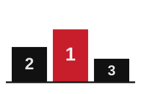

Classical ML (XGBoost/LightGBM) project predicting F1 race winners for the
2022–2026 seasons. Portfolio project, separate from
[BoxBox](https://github.com/NalluriTanavreddy/boxbox) (an F1 data MCP
server) though it adapts BoxBox's Ergast/Jolpica API client code.

Implements the full pipeline end to end: **data ingestion, dataset
construction, feature engineering, weather, model training, evaluation,
and a live prediction interface (API + CLI).**

## Regulation eras

F1's 2026 technical regulations (reduced ground effect, 50/50
electric/combustion power unit split, active aero) are a large enough
discontinuity from the 2022–2025 ground-effect era that the dataset carries
an explicit `era` column (`"2022-2025"` / `"2026"`) rather than treating
season as a smooth numeric trend. `season` and `round` stay as separate
numeric columns for recency-weighting later.

## Setup

```
uv sync
```

## Building the dataset

```
uv run python -m f1_predict.build_dataset
```

This pulls qualifying and race results for every completed round from 2022
through the current season from the
[Jolpica](https://api.jolpi.ca/ergast/f1) API (an Ergast-compatible
drop-in replacement — the original ergast.com shut down after 2024).

- Raw API responses are cached to `data/raw/` (gitignored — regenerate by
  re-running the command; re-runs only fetch rounds not already cached).
- The reshaped dataset is written to `data/processed/race_dataset.parquet`,
  one row per (driver, race). Parquet over CSV because it preserves the
  nullable-int (`Int64`) and `category` dtypes used for `finishing_position`
  and `era` — those matter for how downstream feature engineering handles
  DNFs and the era split, and CSV would round-trip them back to
  ambiguous strings/floats.
- A summary (row/race counts per season and era, DNF count, any rounds
  that failed to fetch) prints at the end.

Sprint races are out of scope as separate rows — only main Grand Prix
qualifying and race sessions get a row. A sprint's result (known before the
main race) is folded in as `sprint_position`/`sprint_points` columns on that
weekend's main-race rows instead.

Pipeline order: `build_dataset` → `weather` → `features`. `weather` enriches
`race_dataset.parquet` in place, so it must run before `features` reads it;
re-running `build_dataset` to pick up new rounds means re-running `weather`
too, to backfill weather for the new rows.


## Dataset schema (`race_dataset.parquet`)

One row per (season, round, driver):

| column | description |
| --- | --- |
| `season`, `round` | numeric, for recency-weighting |
| `era` | `"2022-2025"` or `"2026"` |
| `race_name`, `circuit_id`, `circuit_name`, `country`, `date`, `latitude`, `longitude` | race identifiers |
| `driver_id`, `driver_code`, `driver_name` | driver identifiers |
| `constructor_id`, `constructor_name` | constructor identifiers |
| `quali_position` | qualifying session classification |
| `grid_position` | actual race-start grid slot (post-penalty) |
| `q1_time_s`, `q2_time_s`, `q3_time_s`, `best_quali_time_s` | parsed lap times in seconds |
| `gap_to_pole_s` | `best_quali_time_s` minus the pole sitter's |
| `finishing_position` | nullable — null for DNFs |
| `won` | 1 if `finishing_position == 1` |
| `points`, `status`, `dnf` | race result detail |
| `sprint_position`, `sprint_points` | that weekend's sprint result; null if no sprint |
| `missing_qualifying_data` | true if the round had no qualifying data at all |
| `weather_temp_max_c`, `weather_precip_mm`, `weather_wind_speed_max_kph` | race-day weather, see "Weather" below |
| `weather_rain_probability_pct` | forecast-only; null for every row right now (all races are historical) |
| `weather_source` | `"historical_actual"` or `"forecast"` |


## Building features

```
uv run python -m f1_predict.features
```

Reads `race_dataset.parquet`, adds season-form / constructor-form /
track-history / racecraft features, sets `category` dtype on
`driver_id`/`constructor_id`/`circuit_id`/`era` (native categorical
handling for LightGBM/XGBoost — `season`/`round` stay numeric), assigns a
chronological train/test split, and writes
`data/processed/model_dataset.parquet`. Prints per-feature null rates and
runs structural leakage checks (every rolling/cumulative feature is built
as `shift(1)` before aggregating, so a row can never see its own race or a
later one).

### Season form (driver + constructor)

`points_season_so_far` resets every season — 0 at round 1 is real
information, not missing. The rolling stats (`avg_finish_lastN`,
`win_rate_lastN`, `podium_rate_lastN` for N in {3, 5}) are **not**
season-scoped: they carry over the last N races across a season boundary
*within the same era*, but deliberately reset to null at the 2025→2026
boundary — 2022-2025 form isn't assumed predictive of 2026 pace under
all-new regulations, so those early-2026 rows start null and let the
trees split on that natively rather than smuggling in stale-era signal.
Constructor form is computed once per (constructor, race) — summed points,
mean finish across both cars, either car winning/podiuming — then the same
rolling treatment, so both teammates share identical, leak-free values.


### Track history (driver + constructor, at this circuit)

Unlike season form, this uses **all** prior seasons regardless of era —
a circuit's characteristics don't change with the power-unit/aero rules,
so there's no reason to discard 2022-2025 history for a 2026 row. Null on
a driver's/constructor's first-ever visit to that circuit.

### Racecraft tendency

`driver_racecraft_avg_delta`: career-long average of
`grid_position - finishing_position` (positive = gains positions), shifted
so it never includes the current race. Computed career-wide with no
track-type grouping and no era reset — grid-to-finish racecraft reads as
more of a driver skill than a car/regulation trait, and with only 26
circuits across 106 races there isn't enough data to slice by track type
anyway.


## Weather

```
uv run python -m f1_predict.weather
```

Adds race-day weather (max temp, total precipitation, max wind) to
`race_dataset.parquet`, one lookup per (season, round) — every driver in a
race shares the same race-day weather. Two deliberately separate client
functions, never one that guesses which to use:

- **Historical races** (everything in the dataset today): Open-Meteo's
  *archive* API — actual observed conditions, not a forecast. There's no
  "rain probability" for the past (reanalysis knows whether it rained, not
  the odds beforehand), so `weather_rain_probability_pct` is null on every
  backfilled row.
- **Future races**: Open-Meteo's *forecast* API — a real pre-race forecast,
  including `weather_rain_probability_pct`. Not exercised by the current
  pipeline (every race so far is historical), but ready for a live
  prediction interface.

**Known tradeoff, accepted deliberately**: training on actual historical
weather instead of what a forecast would have said beforehand is *train/serve
skew*, not target leakage — weather doesn't know who wins. But it does mean
evaluation on the 2026 holdout also uses actual weather, since those races
have already happened. The eval numbers in `results/metrics.json` measure
"if weather were known perfectly," not true live-deployment accuracy where
forecast error is a factor. Standard and accepted for backtesting; worth
remembering when reading the eval output.


## Model training

```
uv run python -m f1_predict.train
```

Trains a LightGBM and an XGBoost classifier on `model_dataset.parquet`,
using the `category`-dtype columns natively (no one-hot encoding) and
`scale_pos_weight` on both to correct for the ~1-winner-per-~20-car-field
imbalance. Tuned with a modest Optuna budget (25 trials per model),
validating on 2025 — the most recent pre-2026 season — so the 2026 test
set is never touched during tuning. Final models retrain on the full
2022-2025 training set with the tuned params. Saves
`models/lightgbm_model.pkl` and `models/xgboost_model.pkl`.

**2026 sample weighting — not applied.** The task called for modestly
upweighting 2026-era training rows, since 2026 is sparse but the current
regulation regime. But under the chronological split, *all* 352 2026 rows
are in the test set and none are in train — there is no 2026-era training
row to upweight. The alternative (a walk-forward split moving some 2026
rounds into training) was raised and declined: it would shrink the already
small 16-race test set for a handful of extra training rows, which isn't a
good trade at this dataset size. Revisit once a real chunk of 2026 becomes
historical (e.g. once 2027 is underway).




## Evaluation

```
uv run python -m f1_predict.evaluate
```

Scores both models on the 16-race 2026 holdout and writes
`results/metrics.json`. Top-1/top-3 accuracy are computed per *race*
(argmax / top-3 of predicted win probability among that race's field).
Log loss is computed on probabilities **normalized to sum to 1 within
each race** — the model is trained as an independent per-row binary
classifier, so raw `predict_proba` output isn't constrained to sum to 1
per race the way a proper per-race probability distribution is (see
"Validation" below); the raw, unnormalized log loss is also kept in
`results/metrics.json` for transparency but isn't the number to trust.
The pole-position baseline is reported two ways: a plain win rate, and
(not explicitly requested, but a fairer apples-to-apples comparison) a
proper probabilistic baseline — pole sitter gets `P(win)` = the
training-set pole win rate, the rest of the field splits the remainder
uniformly, which by construction already sums to 1 per race.

Latest run (108 races through 2026 round 16):

| | LightGBM | XGBoost | Pole baseline |
| --- | --- | --- | --- |
| Top-1 accuracy | 68.8% (11/16) | 50.0% (8/16) | 68.8%* |
| Top-3 accuracy | 87.5% (14/16) | 68.8% (11/16) | — |
| Log loss (per-race normalized) | **0.0738** | 0.1113 | 0.1040 |

\* pole win rate on the test set itself; not a top-1 "accuracy" in the same
sense, but the natural number to compare top-1 against.

**LightGBM ties the pole baseline on top-1 (68.8%) and improves on log
loss (0.0738 vs 0.1040)** — with the caveat that 16 test races is a small
enough sample that one or two different results would move these numbers
several points either way; see "Validation" below for how much that tie
actually means. XGBoost doesn't beat the baseline on any metric even
after its own tuning budget. An ensemble isn't worth it: averaging in a
model that underperforms the baseline would only drag LightGBM down, not
complement it. `models/model.pkl` is a copy of whichever model wins on
test log loss (currently LightGBM), so a prediction interface only ever
needs to load one file.

**Racecraft-tendency sanity check**: `driver_racecraft_avg_delta` ranks
4th of 35 features by importance in LightGBM — high enough to ask whether
it's leaning on pre-2026 driver behavior that doesn't transfer to the new
regs (exactly the risk flagged when this feature was built: it's
career-long and deliberately not era-reset). The reassuring sign is that
the model still clearly beats the pole baseline on the 2026 test set
despite that — if this feature's signal didn't transfer, test performance
would be the place it would show up. One 16-race season isn't a strong
guarantee either way, though; worth re-checking as more 2026+ data arrives.


## Validation

```
uv run python -m f1_predict.validate
```

A report-only pass on the LightGBM result, run before building a
prediction interface on top of it — doesn't retrain or change
`models/model.pkl`.

**The top-1 tie with the pole baseline is mostly the model agreeing with
pole, not out-predicting it.** Of LightGBM's 11 top-1 hits, all 11 are
races the pole-sitter also won. Zero hits come from the model correctly
picking a non-pole winner. Looking at the 5 misses, the model's pick
matches the pole sitter in 3 of them too (it just didn't win that time);
the other 2 are the only races where the model deviates from pole at all
— and it's wrong both times:

| Race | Model picked | Actual winner | Pole |
| --- | --- | --- | --- |
| 2026 R5 Canadian GP | RUS | ANT | RUS |
| 2026 R7 Barcelona GP | RUS | HAM | RUS |
| 2026 R9 British GP | ANT | LEC | ANT |
| 2026 R13 Italian GP | VER | ANT | GAS |
| 2026 R14 Spanish GP | VER | ANT | NOR |

So LightGBM's top-1 call matches the literal pole sitter in 14 of 16
races. The real value it adds over pole-picking shows up in log loss and
top-3 (better-calibrated probability mass across the field), not in the
single best guess.

**Simple baselines, same 16 races** — a trivial single-feature model does
better than LightGBM on one metric:

| | top-1 | top-3 | log loss |
| --- | --- | --- | --- |
| LightGBM | 68.8% | 87.5% | 0.0738 |
| Logistic regression (grid position only) | 68.8% | **93.8%** | 0.1371 |
| "Winner is top-3 on the grid" rule | n/a | 93.8% | n/a |

Grid position alone gets *more* top-3 hits (15/16) than LightGBM (14/16)
— on 16 races that's a one-race difference, i.e. noise-level, but it's a
real result, not something to round away. LightGBM's log loss is still
clearly better (0.0738 vs 0.1371), meaning its probabilities are better
calibrated even though the discrete top-3 pick doesn't always reflect it.

**Walk-forward diagnostic** (train on everything strictly before each
2026 race, predict only that race, using LightGBM's already-tuned
hyperparameters — no re-tuning per fold): confirms the fixed-split result
rather than undermining it.

| | top-1 | top-3 | log loss |
| --- | --- | --- | --- |
| Fixed split (`evaluate.py`) | 68.8% | 87.5% | 0.0738 |
| Walk-forward (this check) | 75.0% | 87.5% | 0.0744 |

**Grid position's own importance rank**: 11th of 35 — present and used,
but well behind `driver_circuit_avg_finish`, `driver_points_season_so_far`,
`gap_to_pole_s`, and `driver_racecraft_avg_delta`. Given how closely the
model's top-1 picks track pole above, this is a little surprising; it
suggests the model's effective "trust qualifying" behavior is coming
through `quali_position`/`gap_to_pole_s` more than through grid position
specifically.

**weather_rain_probability_pct was dropped** from the training feature
list (not replaced): it's forecast-only, so it was 100% null across every
row of the current, all-historical dataset — a column that's always null
in training carries no signal to learn from. `weather_precip_mm` already
exists in both the historical-actual and forecast paths and covers the
same "how much rain" signal, so there was nothing to substitute it with.


## Prediction interface

**LightGBM ties the pole-position baseline on top-1 accuracy (68.8%) and
improves log loss (0.0738 vs 0.1040) — checked against only 16 test
races.** Read that as "roughly as good as always picking pole, with
better-calibrated probabilities across the rest of the field," not as a
model that reliably beats an expert human's gut call on who wins. See
Evaluation/Validation above for the full picture, including that the
model's top-1 picks agree with the literal pole sitter in 14 of those 16
races.

### Live feature path

`f1_predict.live_features.build_live_feature_rows(season, round)` builds
a prediction-ready feature row for every driver using only
post-qualifying information: qualifying results from Jolpica, the
existing season-form/constructor-form/track-history/racecraft code
**completely unchanged**, the sprint result if one has happened, and
weather from Open-Meteo's live forecast API (never the historical
archive). It works by appending "stub" rows — real identifiers and
qualifying data, unknown result — to the real race history and re-running
the exact same batch feature pipeline (`features.build_features`) on the
combined frame. That works without any changes to the feature code
because every rolling/cumulative feature there is built as `shift(1)`
before aggregating, so a row's own unknown result is never read to
compute its own feature, and since the stub row is chronologically last,
nothing else depends on it either.

The one feature that's genuinely approximated: `grid_position`. The
model was trained on the real, post-penalty starting grid, which isn't
published until shortly before the race — right after qualifying, the
best available estimate is `quali_position` (no penalty applied yet).

### Skew check

`uv run python -m f1_predict.skew_check` runs the live path on completed
2026 rounds (ignoring their real results) and diffs the output against
the offline `model_dataset.parquet` for the same round — feature by
feature, and the resulting predicted probabilities. Checked against
rounds 14, 15, and 16:

- **No unexpected column differs in any of the three rounds** — direct
  empirical confirmation that the feature code has no hidden dependency
  on the target race's own result.
- `weather_*` differs every time, as expected (forecast vs. archive).
  The forecast is usually close (e.g. round 14: 31.9°C live vs 32.4°C
  actual) but not always (round 15: 32.1 km/h forecast wind vs 22.7 km/h
  actual) — ordinary forecast error.
- `grid_position` differs on some rows in every round (4/20, 9/22, 14/22)
  — real grid penalties the quali-position estimate can't know about.
- Resulting win-probability differences are small (max 0.0039-0.0310
  across the three rounds) and never changed the top pick.
- Round 14 surfaced a real edge case along the way: two drivers
  (`bearman`, `stroll`) appear in that race's results but not in its
  qualifying — a late substitution. The live path's roster comes from
  qualifying, so it doesn't see them; `skew_check.py` reports this
  explicitly as a roster mismatch rather than silently dropping or
  crashing on it.

### API

```
uv run uvicorn f1_predict.api:app --reload
```

- `GET /health`
- `GET /predict/{season}/{round}` — 404 with a clear message if that
  round doesn't exist yet or has no published qualifying session.

Sample response (`GET /predict/2026/16`, truncated to the top 5 drivers):

```json
{
  "season": 2026,
  "round": 16,
  "race_name": "Bahrain Grand Prix in Malaysia",
  "circuit_id": "sepang",
  "drivers": [
    { "driver_id": "max_verstappen", "driver_code": "VER", "driver_name": "Max Verstappen", "constructor_id": "red_bull", "grid_position": 1, "win_probability": 0.8772 },
    { "driver_id": "antonelli", "driver_code": "ANT", "driver_name": "Andrea Kimi Antonelli", "constructor_id": "mercedes", "grid_position": 4, "win_probability": 0.0633 },
    { "driver_id": "hamilton", "driver_code": "HAM", "driver_name": "Lewis Hamilton", "constructor_id": "ferrari", "grid_position": 2, "win_probability": 0.0212 },
    { "driver_id": "russell", "driver_code": "RUS", "driver_name": "George Russell", "constructor_id": "mercedes", "grid_position": 8, "win_probability": 0.0177 },
    { "driver_id": "hadjar", "driver_code": "HAD", "driver_name": "Isack Hadjar", "constructor_id": "red_bull", "grid_position": 3, "win_probability": 0.013 }
  ],
  "metadata": {
    "model_name": "LGBMClassifier",
    "model_trained_through_season": 2025,
    "prediction_generated_at": "2026-10-08T03:42:40.331832+00:00",
    "weather_source": ["forecast"]
  }
}
```

`win_probability` is normalized to sum to 1 across the full driver list
for that race (not shown truncated above).

### CLI

```
uv run python -m f1_predict.predict --season 2026 --round 17
```

Prints the same JSON `predict_race` builds for the API, to stdout.

### Tests

```
uv run pytest
```

`tests/test_live_features.py` and `tests/test_api.py` mock every network
call (`ergast_get`, `fetch_forecast_weather`) and run against the real
committed `models/model.pkl` and `data/processed/race_dataset.parquet` —
no live network access needed to run the suite. One thing worth knowing
if you add a test that mocks `ergast_get`: `fetch_race_schedule_entry`
lives in `f1_predict.ingest` and uses *its own* imported reference to it,
separate from `f1_predict.live_features`'s — patching only one leaves the
other hitting the real network, which is exactly the bug the mock-target
comment in `tests/conftest.py` exists to prevent happening again.


