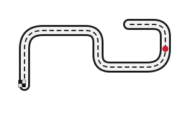

Classical ML (XGBoost/LightGBM) project predicting F1 race winners for the
2022–2026 seasons. Portfolio project, separate from
[BoxBox](https://github.com/NalluriTanavreddy/boxbox) (an F1 data MCP
server) though it adapts BoxBox's Ergast/Jolpica API client code.

Currently implements the **data ingestion, dataset construction, feature
engineering, and weather layers**. Modeling and training are the next stage.

## Regulation eras

F1's 2026 technical regulations (reduced ground effect, 50/50
electric/combustion power unit split, active aero) are a large enough
discontinuity from the 2022–2025 ground-effect era that the dataset carries
an explicit `era` column (`"2022-2025"` / `"2026"`) rather than treating
season as a smooth numeric trend. `season` and `round` stay as separate
numeric columns for recency-weighting later.

## Setup

```
uv sync
```

## Building the dataset

```
uv run python -m f1_predict.build_dataset
```

This pulls qualifying and race results for every completed round from 2022
through the current season from the
[Jolpica](https://api.jolpi.ca/ergast/f1) API (an Ergast-compatible
drop-in replacement — the original ergast.com shut down after 2024).

- Raw API responses are cached to `data/raw/` (gitignored — regenerate by
  re-running the command; re-runs only fetch rounds not already cached).
- The reshaped dataset is written to `data/processed/race_dataset.parquet`,
  one row per (driver, race). Parquet over CSV because it preserves the
  nullable-int (`Int64`) and `category` dtypes used for `finishing_position`
  and `era` — those matter for how downstream feature engineering handles
  DNFs and the era split, and CSV would round-trip them back to
  ambiguous strings/floats.
- A summary (row/race counts per season and era, DNF count, any rounds
  that failed to fetch) prints at the end.

Sprint races are out of scope as separate rows — only main Grand Prix
qualifying and race sessions get a row. A sprint's result (known before the
main race) is folded in as `sprint_position`/`sprint_points` columns on that
weekend's main-race rows instead.

Pipeline order: `build_dataset` → `weather` → `features`. `weather` enriches
`race_dataset.parquet` in place, so it must run before `features` reads it;
re-running `build_dataset` to pick up new rounds means re-running `weather`
too, to backfill weather for the new rows.


## Dataset schema (`race_dataset.parquet`)

One row per (season, round, driver):

| column | description |
| --- | --- |
| `season`, `round` | numeric, for recency-weighting |
| `era` | `"2022-2025"` or `"2026"` |
| `race_name`, `circuit_id`, `circuit_name`, `country`, `date`, `latitude`, `longitude` | race identifiers |
| `driver_id`, `driver_code`, `driver_name` | driver identifiers |
| `constructor_id`, `constructor_name` | constructor identifiers |
| `quali_position` | qualifying session classification |
| `grid_position` | actual race-start grid slot (post-penalty) |
| `q1_time_s`, `q2_time_s`, `q3_time_s`, `best_quali_time_s` | parsed lap times in seconds |
| `gap_to_pole_s` | `best_quali_time_s` minus the pole sitter's |
| `finishing_position` | nullable — null for DNFs |
| `won` | 1 if `finishing_position == 1` |
| `points`, `status`, `dnf` | race result detail |
| `sprint_position`, `sprint_points` | that weekend's sprint result; null if no sprint |
| `missing_qualifying_data` | true if the round had no qualifying data at all |
| `weather_temp_max_c`, `weather_precip_mm`, `weather_wind_speed_max_kph` | race-day weather, see "Weather" below |
| `weather_rain_probability_pct` | forecast-only; null for every row right now (all races are historical) |
| `weather_source` | `"historical_actual"` or `"forecast"` |


## Building features

```
uv run python -m f1_predict.features
```

Reads `race_dataset.parquet`, adds season-form / constructor-form /
track-history / racecraft features, sets `category` dtype on
`driver_id`/`constructor_id`/`circuit_id`/`era` (native categorical
handling for LightGBM/XGBoost — `season`/`round` stay numeric), assigns a
chronological train/test split, and writes
`data/processed/model_dataset.parquet`. Prints per-feature null rates and
runs structural leakage checks (every rolling/cumulative feature is built
as `shift(1)` before aggregating, so a row can never see its own race or a
later one).

### Season form (driver + constructor)

`points_season_so_far` resets every season — 0 at round 1 is real
information, not missing. The rolling stats (`avg_finish_lastN`,
`win_rate_lastN`, `podium_rate_lastN` for N in {3, 5}) are **not**
season-scoped: they carry over the last N races across a season boundary
*within the same era*, but deliberately reset to null at the 2025→2026
boundary — 2022-2025 form isn't assumed predictive of 2026 pace under
all-new regulations, so those early-2026 rows start null and let the
trees split on that natively rather than smuggling in stale-era signal.
Constructor form is computed once per (constructor, race) — summed points,
mean finish across both cars, either car winning/podiuming — then the same
rolling treatment, so both teammates share identical, leak-free values.



### Track history (driver + constructor, at this circuit)

Unlike season form, this uses **all** prior seasons regardless of era —
a circuit's characteristics don't change with the power-unit/aero rules,
so there's no reason to discard 2022-2025 history for a 2026 row. Null on
a driver's/constructor's first-ever visit to that circuit.

### Racecraft tendency

`driver_racecraft_avg_delta`: career-long average of
`grid_position - finishing_position` (positive = gains positions), shifted
so it never includes the current race. Computed career-wide with no
track-type grouping and no era reset — grid-to-finish racecraft reads as
more of a driver skill than a car/regulation trait, and with only 26
circuits across 106 races there isn't enough data to slice by track type
anyway.


## Weather

```
uv run python -m f1_predict.weather
```

Adds race-day weather (max temp, total precipitation, max wind) to
`race_dataset.parquet`, one lookup per (season, round) — every driver in a
race shares the same race-day weather. Two deliberately separate client
functions, never one that guesses which to use:

- **Historical races** (everything in the dataset today): Open-Meteo's
  *archive* API — actual observed conditions, not a forecast. There's no
  "rain probability" for the past (reanalysis knows whether it rained, not
  the odds beforehand), so `weather_rain_probability_pct` is null on every
  backfilled row.
- **Future races**: Open-Meteo's *forecast* API — a real pre-race forecast,
  including `weather_rain_probability_pct`. Not exercised by the current
  pipeline (every race so far is historical), but ready for a live
  prediction interface.

**Known tradeoff, accepted deliberately**: training on actual historical
weather instead of what a forecast would have said beforehand is *train/serve
skew*, not target leakage — weather doesn't know who wins. But it does mean
evaluation on the 2026 holdout also uses actual weather, since those races
have already happened. The eval numbers in `results/metrics.json` measure
"if weather were known perfectly," not true live-deployment accuracy where
forecast error is a factor. Standard and accepted for backtesting; worth
remembering when reading the eval output.


